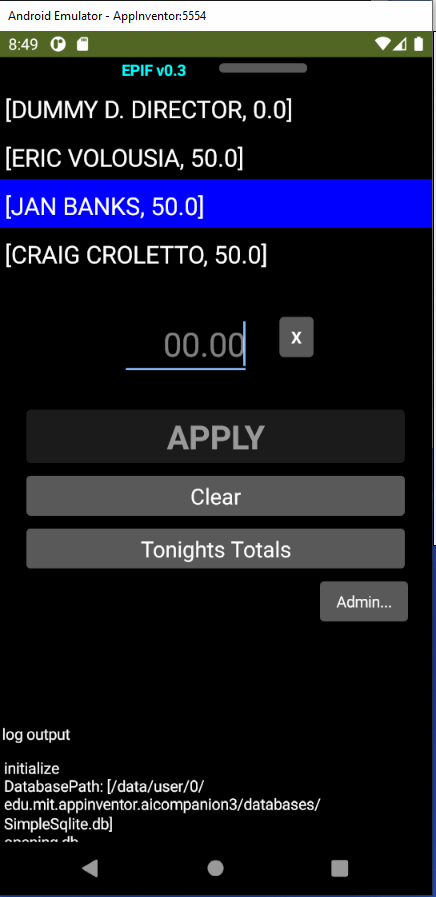
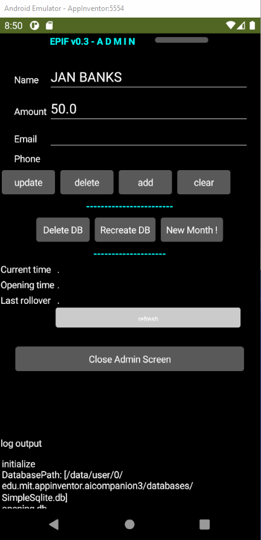
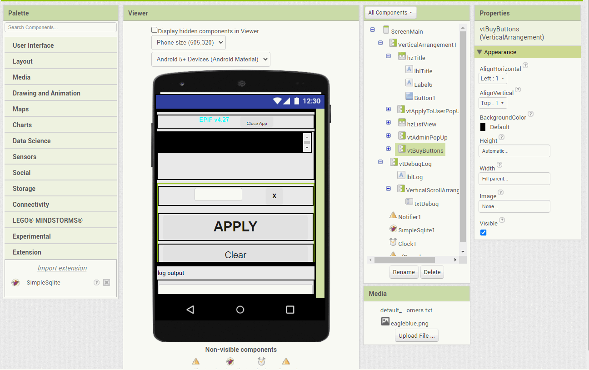
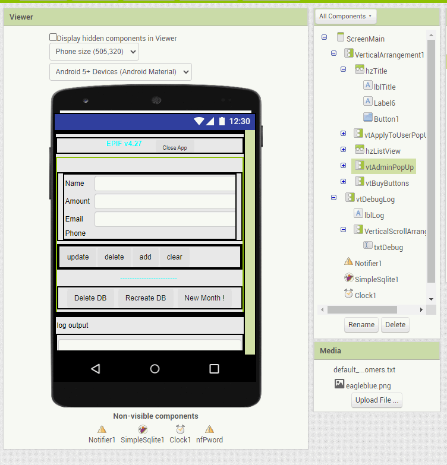
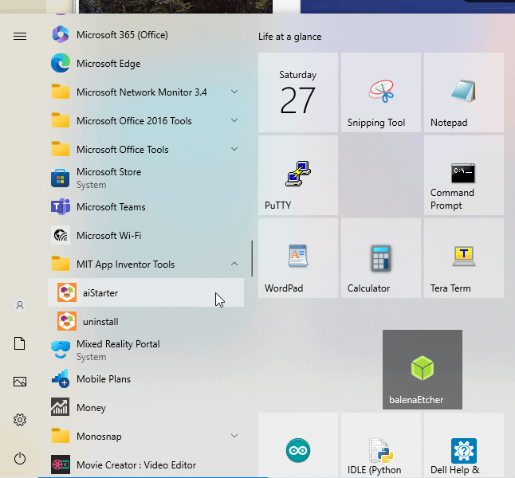
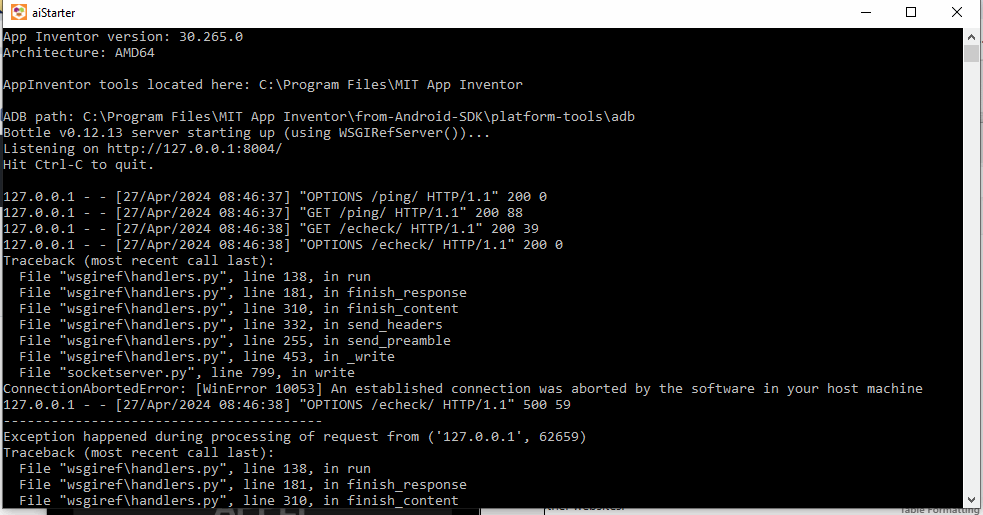
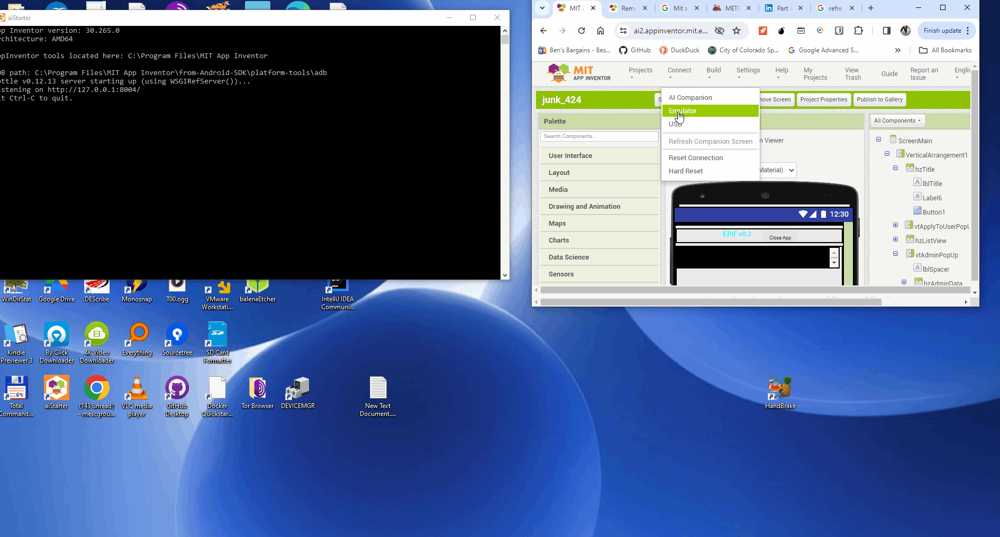
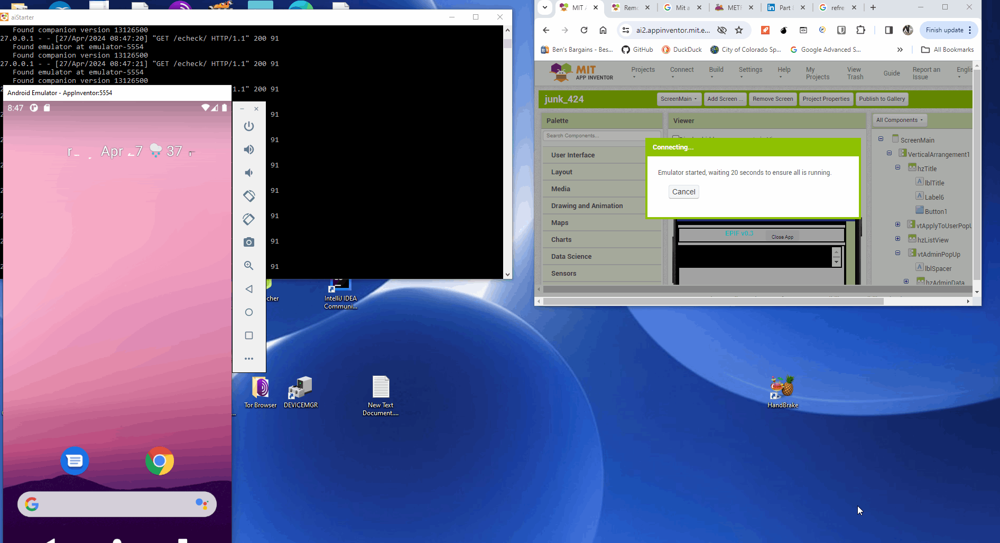
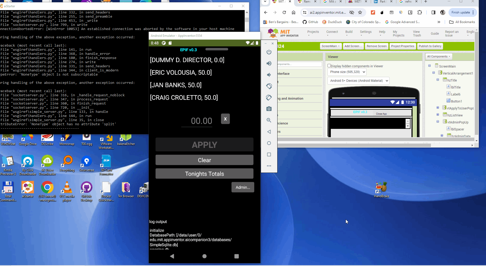

# Eagle Pay It Forward MIT AI2 Cashier App

This project contains information for the EPIF application which resides under the Egor The Rat account, currently as junk_427.  The exported project as of 4-27-24 is in the `junk_427.aia` file in this folder.

The app allows a cashier to keep track of a database of customers who have access to X number of tokens or gift certificate dollars each month.

Each month all customers' accounts can be reset to X number of tokens.

When a customer wants to apply (spend) his/her tokens, s/he asks the cashier to apply his/her tokens.

## Example Use Case
Example: a customer, Bill, wants to buy a beer for $5, but wants to use $2.50 worth of his tokens.  He gives the cashier $2.50 cash, and then asks the cashier to apply the other $2.50 from his token account.  The cashier uses the app to decrement $2.50 worth of tokens from Bill's account.  Bill now has (X-2.5) worth of tokens in his account.  Additionally, the app keeps track of the total number of tokens being used for the day.  At the end of the day, the app will report the number of tokens that were used for the day.

## Design Info
EPIF is an MIT AI2 program.  It uses the SimpleSqlite extension for persisting customer and payment information.  The datababse contains three tables:
1. A `customer` table that contains customer name and number of available tokens
2. An `orders` table that keeps track of all the token/customer transactions
3. An `admin` table that stores information about the program

The app also has the following features:
1. SQLite SQL database, as mentioned above
2. Splash screen start up
3. Multi-screen pseudo views (aka virtual screens)
4. Several pop-up/confirm and a password protection capabilities
5. Debug/log output area

### First Screen
The first screen is just a splash screen that displays the main logo for the app and then brings up the main screen.

### Main Screen
The main screen is designed as a single program app (SPA), consisting of the main payment screen, a payment confirmation popup screen, and an administration screen.  Also, a debug/log output is present near the bottom of each screen where debug information is written as the app is executed.

#### Main Payment View
This is the main screen.  Here, a cashier highlights a customer and, if the customer has tokens avaialable (i.e. more than 0 tokens), then the text entry in the middle of the screen is enabled and the cashier can enter the amount of tokesn the customer wants to spend.  The APPLY button will be enabled only if the number of tokens to spend is less than or equal to the number of tokens that the customer has in his/her account.  The cashier can then click the APPLY button, which brings up the payment confirmation screen.

#### Payment Confirmation View
This screen appears when the cashier presses the APPLY button.  If the OK button is pressed, then the number of tokens entered on the main screen will be deleted from the customer's account (in the Sqlite customer table) and the amount of tokens used during the day will be updated  (in the Sqlite orders table)
(sorry, image not available due to crappy emulator)

#### Admin View
This screen appears when the Admin button from the main screen is selected (it is password protected so a pop-up password screen appears first).  This screen allows the admin to create/update/delete customers.  It also has a button that will reset all customers' token amount when a new month rolls over (there is a protection to prevent multiple roll overs in a single month).

## Notes on MIT AI2 Development
1.  Development is performed on-line (internet connection required!) on the MIT AI2 site.  <i>Note: there are ways to develop offline, e.g. see https://github.com/cobinrox/ai2offline for developing off-line using docker containers.

</i>

2.  Always use the Vertical and Horizontal layouts to place your components

3.  To create the sense of multiple screens but using only one physical screen, use multiple Vertical layouts for each screen, and set the visible checkbox to on and off to see them in the developer view.  The advantage of having just one physical screen and hide/view the various Vertical layouts is that you can use the block code (variables/methods) across the components, whereas doing so between physical screens is difficult.  The disadvantage, though, is that the number of blocks for the single screen can get huge and make it hard to read.  The following image shows the main screen of the EPIF app, with the main payment view set to hidden, and the admin sub-screen set to visible:

</i>

4. When you are ready to test out what you have built on the site (the "app"), there are several ways to test, but note that each method has its idiosyncracies and some just suck.
     - OPTION 1: Run the app on an MIT AI2 tool/emulator that runs on your laptop.  This is nice and easy to use but the emulator does not always work right.  You can run other emulators on your laptop.  The MIT AI2 emulator comes bundled in a program called the MIT AI2 Tools (which is confusing) and the emulator is called the "ai starter" (also confusing).  its start up is demonstrated in the following figures.

          - Start up the emulator (aka "ai starter") from the MIT AI2 Tools app on your laptop, this will start up a command-line terminal
          - </i>
          - </i>

          - From the MIT AI2 web site, choose the Connect, Emulator option and the web site will try to connect to the emulator on your laptop
          - </i>

          - </i>
          - Eventually the web site and the emulator will sync up and you should see your app running on the emulator on your laptop
          - </i>

     - OPTION 2: Run the app on an actual android phone through the MIT AI2 Companion that runs on your phone.  You have to download the MIT AI2 Companion onto your phone first, and your MIT AI2 app runs <i>inside</i> of the Companion app.   This is nice but can be tedious because you have to fumble with your phone.  Usually, once your app is running within the Companion app, you can tweak the app's components on the MIT AI2 web site and the changes re reflected automatially (with a slight delay) onto the phone.  Sometimes, though, the Companion app will crash.  For this option you have to:
          - Download and install the MIT AI2 Companion program to your phone.
          - Start the Companion program on your phone.
          - From the MIT AI2 web site, choose the Connect, then AI Companion option
          - The MIT AI2 web site will pop up a QR code and a 4-digit number
          - Back on your phone, inside the Companion app, enter the 4-digit number (or you can try using the QR code, though sometimes that does not work)
          - Your app will be downloaded from the web site and will start running inside the Companion app on your phone.

     - OPTION 3: Build the app and then download the actual app as an apk file to your phone.  This is very tedious but can give you the best bet of how your app will behave.  There are several ways to do this, but the most straight-forward is:
          - On the MIT AI2 web site, choose the "Build .apk" option
          - The web site will compile and bundle your app into an apk file and then pop up a screen with a both download link and QR code.  
          - </i>
          - There are several ways to download and install the .apk file, but to simply download and install on a phone, you can do the following sub-steps.
          - Right mouse click on the link and save the copy link address to a text editor on your laptop, this will allow you to actually view the link that you will need
          - On the phone, bring up a browser and in the browser search bar, enter the link that from the above step
          - The browser on the phone will give you nag screens about the safety of the app, but confirm to download it, and then the browser should nag and confirm to install it, and then finally, there should be yet another nag and confirm to start the app.  If the latter does not appear, then yoiu should be able to go to the Apps list on the phone and see your newly downloaded and installed app.
   

## References
1. https://ai2.appinventor.mit.edu/
2. https://www.professorcad.co.uk/appinventorsnippets
2. https://ai2.metricrat.co.uk/guides/working-with-sqlite
3. https://community.appinventor.mit.edu/t/all-rescued-extensions-from-thunkable-classic-community/56204
4. https://youtu.be/CFQrO6udZrY
5. https://github.com/cobinrox/ai2offline
